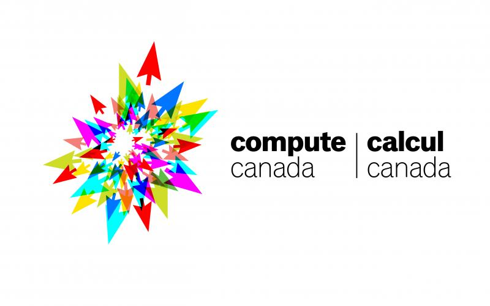

+++
# About widget.
widget = "blank"  # See https://sourcethemes.com/academic/docs/page-builder/
headless = true  # This file represents a page section.
active = true  # Activate this widget? true/false
weight = 80  # Order that this section will appear in.

title = "Funding"

[design]
  # Choose how many columns the section has. Valid values: 1 or 2.
  columns = "1"
[design.spacing]
  # Customize the section spacing. Order is top, right, bottom, left.
  padding = ["20px", "0", "20px", "0"]
+++
Funding and support is graciously provided by the following sources.

  

 
  
 Natural Sciences and Engineering Research Council of Canada  
      Discovery Grant, Accelerator Supplement, Launch Supplement    
      (April 2020 - Present)  

  

  
 Compute Canada  
      Resources for Research Groups (with Xi He)   
      (April 2020 - Present)  

  

 
  
 University of Waterloo Cheriton School of Computer Science  
      Startup Grant   
      (July 2019 - Present)  

